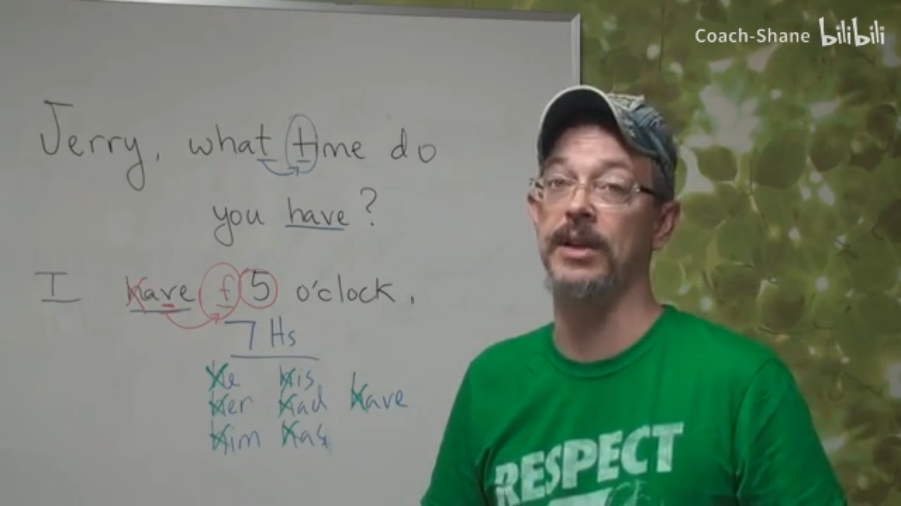
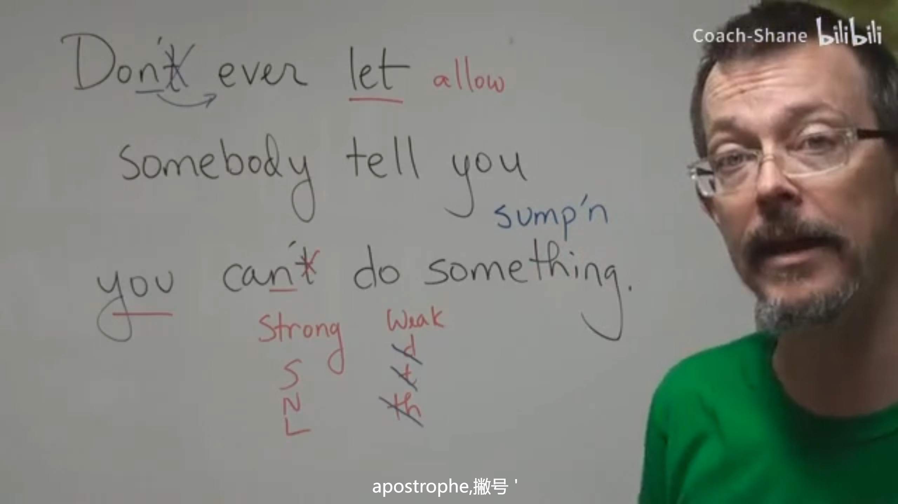

## Daily English Dictation

> 参考：https://www.bilibili.com/video/BV1U7411a7xG

### Daily 2

dies：当提到历史内容时，不使用过去式，而是自身投入到当时的场景中，使用一般现在时

### Daily 3

What time：当两个发音一样时，只读第二个发音

`7Hs`：he, his, him, her, had, has, have，其中'h'说的快，我们听不到发音

### Daily 4

### Daily 5

