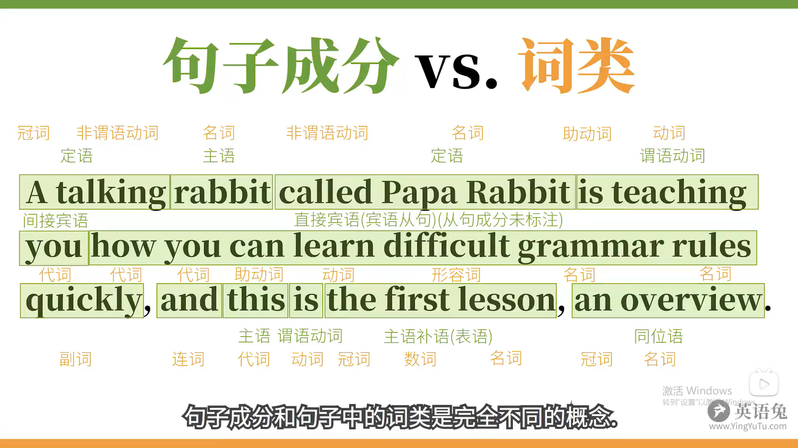
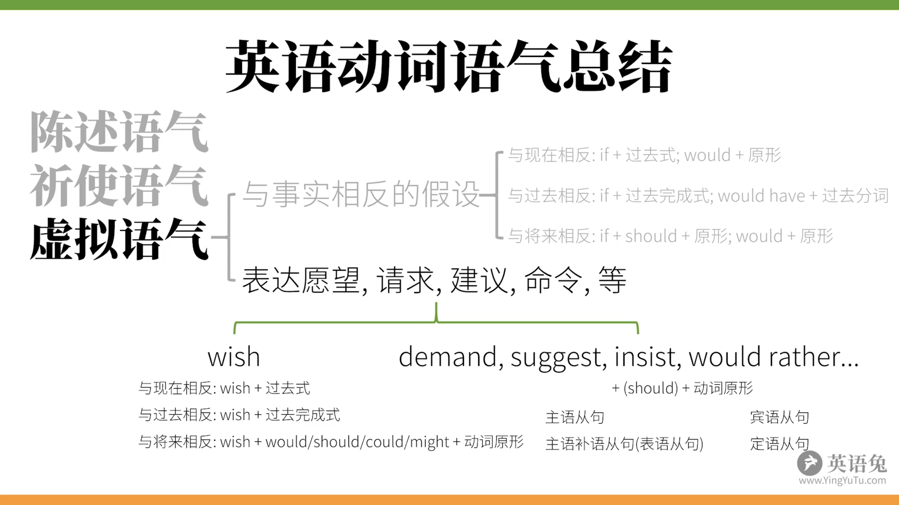
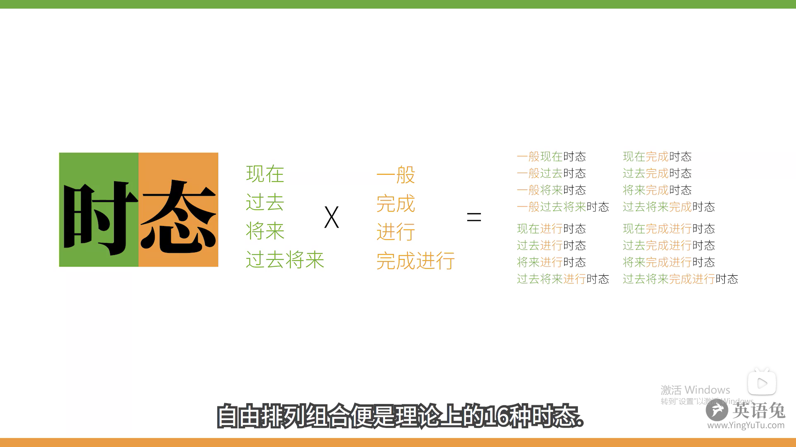
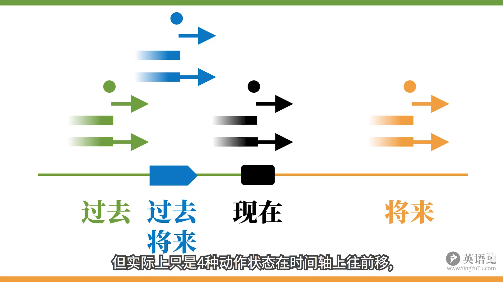
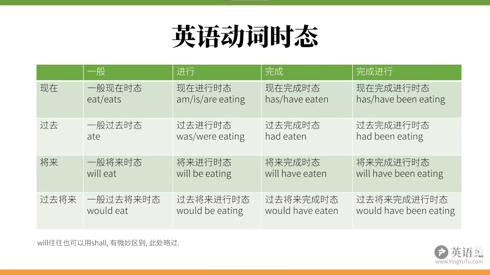
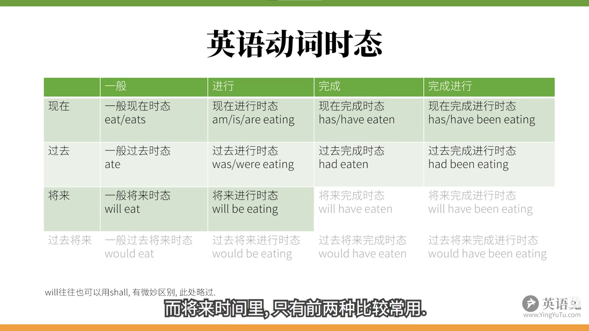
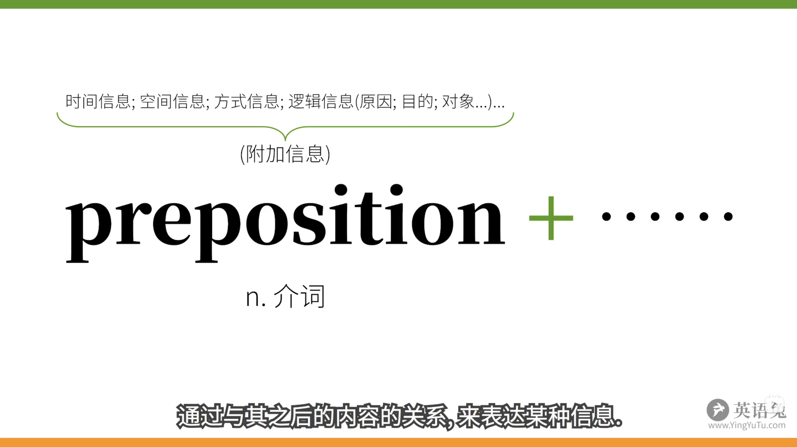
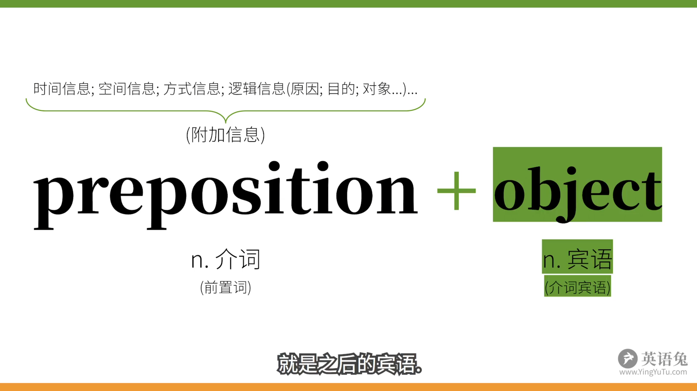
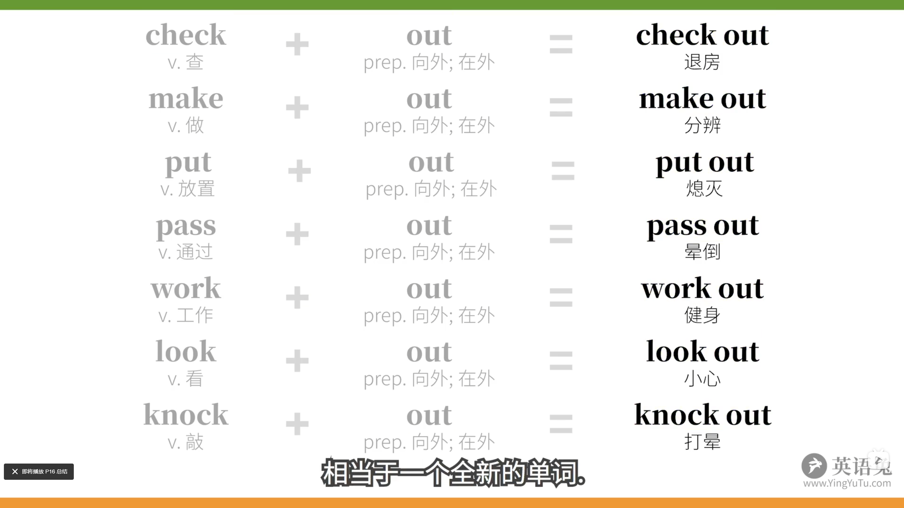

参考：**[语法体系(重要)](https://www.bilibili.com/video/BV1r54y1m7gd)**

# 1.简单句

> 所有句子拆到不能再拆都是：什么怎么样，又称主语+谓语

## 1.1.谓语动词

> 五种谓语动词对应五种基本句型

1. 可以独立完成的动作						主语+**不及物动词**									   He **sleeps**.
2. 有一个动作的承受者                        主语+**单及物动词**+宾语                             He **likes** you.
3. 有两个动作承受者						    主语+**双及物动词**+间接宾语+直接宾语    He **teaches** you English.
4. 只有一个动作承受者(不同于2)        主语+**复杂及物动词**+宾语+(宾语)补语     He **considers** you smart.
5. 把这个词后面的信息赋予给前者     主语+**系动词**+(主语)补语(表语)                He **is** tall. He **looks** tall.

### 1.1.1.句子成分

> 同一类句子成分中可能有不同的词类

1. 主语
2. 谓语动词(~谓语)
3. 宾语
4. 宾语补语：补充宾语信息  He considers you **smart**.
5. 主语补语：补充主语信息  He is tall. He looks **tall**.
6. 定语：修饰主语和宾语   **The little white** rabbit ate **a large** carrot.
7. 状语：修饰谓语动词的词 The rabbit ate **quickly**.
8. 同位语：再把主语说一遍 Papa Rabbit, **an English teacher**, eat a carrot.

### 1.1.2.十大词类

1. 名词        表人和物                                    Papa Rabbit is a **rabbit**.
2. 冠词        说明人和事物                            Papa Rabbit is **a** rabbit.
3. 代词        替代人和物                                **I** am a rabbit.
4. 形容词    形容人和物                                I am a **smart** rabbit.
5. 数词        表数量                                        I ate **two** carrots.
6. 副词        修饰动词或者形容词等             I ate two carrots **quickly**.
7. 介词        表示和其他词关系的词             l ate two carrots **with** chopsticks.
8. 叹词        表感叹                                        **Ah**, the carrot is tasty!
9. 连词        连接词和句                                l ate two carrots **and** a potato, **because** I was hungry.
10. 动词        参考上面的五种基本句型中的动词

**句子成分vs词类**

### 1.1.3.三大本领

> **合称：TAM：时(Tense) 体(Aspect) 气(Mood) ，时间和状态成为时态，自由排列组合有16种时态**

+ **表示动作的时间**：现在，过去，将来，从过去某个时间点"算将来"(过去将来)
+ **表示动作的状态**：未说明(一般)，完成，进行，不但完成而且继续(完成进行)
+ **表示动作的假设，情感等**： If I were a rabbit. 虚拟语气，这里用were而不是was暗示 并自己并不是兔子

>**英语的谓语动词本身往往是不能独立完成刚才所说的那些本领，需要助动词来帮助**，例如：吃 Eat

+ 为了协助它表示吃过了(完成态),就要用到助动词, have,  have eaten.

+ 为了协助它表示正在吃(进行态),就要用到助动词, be,  is eating.

+ 为了协助它表示是"被"吃,就要用到助动词be, is eaten.

+ 为了协助它表示有能力吃,就要用到助动词can,  can eat.

+ 为了协助它表示有可能吃,就要用到助动词might,  might eat.

+ 为了协助它表示有义务吃,就要用的助动词must,  must eat.

+ 为了协助它表示否定,不吃,就需要用到助动词do, do not eat.

  不要把助动词和其他身份(实义动词)弄混淆

## 1.2.非谓语动词

> 非谓语动词不受主语限制，不具备表达时间和人称的本领
> 非谓语动词可以充当除谓语动词外的所有句子成分，取代所有从句，简化句子

~~The rabbit like eat carrots.~~  为什么不能这样造句呢？其实就是没搞清楚非谓语动词

### 1.2.1.动词不定式

>不受时间，人称等概念限制  **to + 动词原形**

+ **To be** or not **to be**, that is the question. (完全不定式)
  生存还是毁灭，这是一个问题
+ You helped me (**to**) cook the carrot. (裸不定式)
  你帮我烧(做菜)了胡萝卜

**(1)不定式作主语**

+ **To eat** a carrot every day is good for the rabbit.
  一天吃一根胡萝卜对兔子有好处. (单独看到to eat 不知道是谁吃，什么时候吃，还不能确定所以才是不定式，不受具体的人和时间的限制，就是单纯的再说一天吃一个胡萝卜的概念)
+ It is goods for the rabbit **to eat** a carrot every day. = It is goods that the rabbit eats a carrot every day.一天吃一根胡萝卜对兔子有好处 (这是转为了形式主语)

**(2)不定式作宾语**

+ The rabbit likes **to eat carrots**.
  兔子喜欢吃胡萝卜
+ I consider it important **to eat a carrot every day**.
  我发现每天吃一个胡萝卜很重要.

**(3)不定式作宾语补语**

+ The rabbit expected the wolf **to eat a carrot**.
  兔子指望狼吃一根胡萝卜. 
+ 有些谓语动词，**see, find, watch, have make, let** ···,这些**使役动词**后接宾语，再接省略to的动词不定式作宾语补足语，也就是裸不定式
+ Carrots make the rabbit **feel** happy.
  胡萝卜使兔子感到快乐

(**4)不定式作定语**

+ The rabbit has a lot of carrots **to eat**.
  兔子有很多胡萝卜要吃. 不定式to eat 做后置宾语修饰carrots. 表示胡萝卜是会被吃的，他们之间是动宾关系

**(5)不定式作状语**

+ 表原因
  I was surprised **to get a thumbs-up**.
  我很吃惊(因为)得到一个赞
  l was surprised because I got a thumbs-up. (相当于原因状语从句)
  我很吃惊,因为有人给我点赞了.

+ 表目的
  I will do anything **to get a thumbs-up**.
  我为了得到一个赞会做任何事
  I will do anything in order that I get a thumbs-up. (相当于目的状语从句)
  为了点赞量我能做出任何事儿

+ 表结果
  l got enough thumbs-up **to make another video**.
  我得到足够的赞,可以去做另一个视频啦!
  l got enough thumbs-up, so that I made another video. (相当于结果状语从句)
  我得到了很多点赞,于是我做了另一个视频.

**(6)高级不定时**

>把不定式和状态相结合，to + 动词原形 (状态)

+ to be eating a carrot
  The rabbit seemed to be eating a carrot.
  这兔子之前似乎在吃一根胡萝卜(的过程中).

+ to have eaten a carrot

+ to have been eating a carrot

### 1.2.2.动名词

> 把动词原形后 + ing，就能把动词转化为**名词**来用。名词可以做的成分，动名词同样可以承担。

**(1)动名词作主语**

+ Carrots are healthy for the rabbit.
  胡萝卜对兔子来说很健康.
+ **Eating carrots** is healthy for the rabbit.
  **吃胡萝卜**(这个行为)对兔子来说很健康.

**(2)动名词作主语补语(表语)**

+ The rabbit's hobby is **growing carrots**.
  兔子的爱好是**种胡萝卜**.

**(3)动名词作定语**

+ a **sleeping** pill 安眠药，这里作定语修饰药，是为了睡眠用的，也就是 a pill for **sleeping**(名词).

**(4)动名词作宾语**

+ The rabbit likes **eating carrots**.
  兔子喜欢**吃胡萝卜**

**(5)有些动词后面不可以用不定式**

+ ~~The rabbit enjoys to eat carrots.~~
  The rabbit enjoys eating carrots.
  兔子喜欢吃胡萝卜.

  类似的动词还有avoid, advise, consider, escape, mind, practice
  动词词组有insist on, give up, feel like, put off

**(6)介词 + 宾语**

>这里宾语不能是谓语动词，只能是非谓语动词(动名词)

+ The rabbit is fond of **eating** carrots.
  兔子喜欢吃胡萝卜.
+ The rabbit is looking forward to **seeing** the wolf again.
  兔子期望再次见到狼.(look forward to 是个短语，句子中的to，不是不定式中的to)

**(7)不定式作宾语 vs 动名词作宾语**

>forgot + to 忘记去做；forgot + doing 忘记做过

+ The rabbit stopped **to eat** a carrot.
  兔子**停下(手里的活)**去吃―根胡萝卜. (停下手中的活，去作另一件事)
  The rabbit stopped **eating** a carrot.
  兔子**停止吃**一根胡萝卜. (停止正在作的事)

+ The wolf forgot **to invite** the rabbit to her party.
  狼**忘记邀请**兔子去她的聚会. (没邀请)
  The wolf forgot **inviting** the rabbit to her party.
  狼**忘记了邀请过**兔子去她的聚会. (邀请过 但忘了这件事)

### 1.2.3.现在分词

>现在分词并不带时间的属性，只带状态(现在进行时，过去进行时等，里面的时间是由be动词携带，而非现在分词)，现在分词基本上相当于**形容词**
>

+ a **talking** rabbit (现在分词)
  一只说话的兔子
+ a **talking** rabbit (动名词)
  一只会说话的兔子

**(1)动名词作定语 vs 现在分词作定语**

+ a sleeping pill 一片安眠药，这里的sleeping是动名词，用来说明药片的性质，功能和用途，相当于 a pill for sleeping
+ a **sleeping** rabbit **≠** a rabbit for sleeping，这里的sleeping是现在分词，相当于一个性形容词，用来修饰兔子的状态，在睡觉，只知道兔子的状态是在睡觉，但是不知道具体的时间

**(2)现在分词作表语**

> 我们平时说的用来形容人和物的词，其实都是现在分词，比如

+ The rabbit is **smart**.
  兔子是聪明的. (形容词)
+ The rabbit is **charming**.
  兔子是有魅力的. (现在分词)
+ The story is **interesting**.
  故事是有趣的. interest 👉 interesting
+ The game is **exciting**.
  游戏是刺激的. excite 👉 exciting
+ The news is **encouraging**.
  新闻是鼓舞人心的. encourage 👉 encouraging 

**(3)现在分词作宾语补足语**

+ The wolf saw the rabbit **eating a carrot**.
  狼之前看到兔子正在吃一根胡萝卜.

**(4)动词不定式作宾语补足语 vs 现在分词作宾语补足语**

+ The wolf saw the rabbit **eating** a carrot. (现在分词)
  狼之前看到兔子正在吃一根胡萝卜. (表示动作正在进行中，强调动作进行的状态)
+ The wolf saw the rabbit **eat** a carrot. (动词不定式)
  狼之前看到兔子吃了根胡萝卜. (表示一个动作自始至终的过程，强调动作已经发生了)

**(5)现在分词作状语**

>表示时间，原因，条件，结果，让步，目的，方式和伴随情况等
>

+ **Hearing the news**, the rabbit became excited.
  听到这个消息,兔子很激动. （表示时间）
  When he heard the news, the rabbit became excited.
  听到这个消息时,兔子很激动. (时间状语从句)

+ **Not knowing what to eat**, the rabbit skipped lunch.
  不知道吃什么,兔子没吃中饭.（表示原因）
  Because he didn't know what to eat, the rabbit skipped lunch.
  听到这个消息时,兔子很激动.(原因状语从句)

现在分词做状语跟相应的状语从句之间，有一种剪不断理还乱的关系，其实非谓语动词在很大程度上简化了从句，使得句子言简意赅

### 1.2.4.过去分词

>不自带时间概念，和现在分词一样，只是携带**状态**
>
>**minced** meat 绞过的肉
>**minced** carrot 绞过的胡萝卜
>
>The rabbit will eat **minced** carrot next week.
>兔子下周会吃搅碎的胡萝卜.
>

>minced (过去分词) 作定语，可以把单个过去分词看做**形容词**
>
>a **minced** carrot 一根绞碎的胡萝卜
>a **painted** room 一个漆过了的房间
>an **excited** rabbit 一只激动的兔子

>**过去分词短语修饰名词**，要放在名词之后，即**后置定语**
>
>The carrot cake **eaten by** the rabbit is delicious.
>被兔子吃了的胡萝卜很美味.

**(1)过去分词作主语补语(表语)**

+ The rabbit is **interested** in growing carrots. 
  兔子对种胡萝卜感兴趣.
+ sb. is **interested**(过去分词) in doing sth.
  有着过去分词的主系表结构，而且这里还有个动名词

**(2)现在分词作主语补语(表语)和过去分词作主语补语区别**

+ The story is interesting. (**主动**)
  故事有趣.  现在分词暗含主动关系，即被描述的是做出动作的人/物，暗含意义是故事**让**人感到有兴趣
  The rabbit is interested. (**被动**)
  兔子很感兴趣. 而过去分词暗含被动关系，即被描述的是动作的接受者，暗含意义是,兔子**被**某事某物引起了兴趣

+ The rabbit was frightening.  (主动)
  兔子**让**人感到害怕.
  The rabbit was frightened. (被动)
  兔子(**被事**)感到害怕.

+ l am interesting. (主动)
  我是有趣的(我让人感到有趣)
  l am interested. (被动)
  我**被**某人/某物引起了兴趣.

**(3)过去分词作宾语补语**

+ The rabbit found his carrot **stolen**.
  兔子发现他的胡萝卜被偷了.
+ **Seen** from the hill, the carrot field looks beautiful. (表地点)
  从山上看,胡萝卜田看上去很美.
+ **Born** in a rabbit family,the rabbit's only work is growing carrots. (表原因)
  由于出生在一个兔子家庭里,兔子的唯一工作就是种胡萝卜.
+ **Given** another chance,the rabbit would go to the wolf's party. (表条件)
  如果再给兔子一次机会,他会去参加狼的聚会.

>~~**Seeing** from the hill, **the carrot field** looks beautiful.~~
>  从山上看，胡萝卜田看上去很美. (这里主语胡萝卜田是被看，所以用过去分词)
>
>如何区分到底使用现在分词，还是过去分词，其实还是看句子中主语到底是主动的含义，还是被动的含义

+ **Seeing** the carrot field, **the rabbit** ran towards it.
  看到胡萝卜田，兔子朝着它跑去.  主语是兔子，兔子主动看到了胡萝卜田

**(4)高级用法 👉 独立主格**

>**一个简单句出去核心的谓语动词外，其他的动词转为对应的过去分词或现在分词的用法，称作独立主格**。
>因为在以上的句子中，现在分词/过去分词是在句中的状语里(并非句子的主语)，但是在状语本身里，分词修饰的对象(以上句中的work和weather)，隐含了一层"主语"的意味，虽然并不是整句的主语
>

+ The work **finished**(过去分词), the rabbit **went**(谓语动词) home. (简单句)
  工作完成后，兔子回家了. (这里的finished过去分词修饰的the work)
+ The work was **finished**, and/so the rabbit went home. (并列句)
  工作完成后，兔子回家了.
+ After the work was **finished**, the rabbit went home. (从句)
  工作完成后，兔子回家了.
+ The weather **permitting**, the rabbit will go out.
  天气允许的话，兔子就出门.
+ If the weather **permits**, the rabbit will go out.
  天气允许的话，兔子就出门.

> 使用独立主格

>Because the wolf invited him, the rabbit decided to go to the party.
>因为狼邀请了兔子，所以兔子决定去参加聚会了.
>
>简化句子
>
>The wolf **inviting** him, the rabbit decided to go to the party.
>因为狼邀请了兔子，所以兔子决定去参加聚会了. 
>(前半句wolf是主动，所以用主动现在分词inviting，the rabbit decided to go to the party才是主干，而前面The wolf **inviting** him中，invite是由wolf发出的，而不是真正的主语rabbit发出的动作，所以语法上把wolf称为动词invite的**逻辑主语**，而这就是独立主格中的主格；独立指的是wolf是游离于真正主语rabbit之外的，在The wolf **inviting** him中，自立门户，独立了出来，这个独立的主语还不能跟真正的主语相提并论，要不怎么说是独立主格，而不是独立主语呢)
>

+ If the weather permits, the rabbit will go out. (引导条件状语从句)
  如果天气允许，兔子就会出门.
  The weather **permitting**, the rabbit will go out. (独立主格)
  如果天气允许，兔子就会出门.
+ After the work was finished, the rabbit went home. (引导时间状语从句)
  工作完成后，兔子回家了.
  The work **finished**, the rabbit went home.
  工作完成了，兔子回家了.
+ The rabbit is lying in bed and a carrot is still held in his hand. (并列句)
  兔子正躺在床上，胡萝卜仍在他手中.
  The rabbit is lying in bed,a carrot still **held** in his hand.(独立主格)
  兔子正躺在床上，胡萝卜仍在他手中.

**(5)独立主格**

+ 名词/代词 + 现在分词				the wolf **inviting** him
+ 名词/代词 + 过去分词                a carrot **held** in the hand
+ 名词/代词 + 动词不定式
+ 名词/代词 + 名词
+ 名词/代词 + 形容词
+ 名词/代词 + 副词
+ 名词/代词 + 介词短语
+ ······

**(6)谓语动词vs非谓语动词**

>谓语动词进行修改可以改为非谓语动词，非谓语动词几乎可以取代所有从句，从而简化句子
>只不过这样的动词就不再具有表示动作时间，状态，语态，语气的功能
>
>**谓语动词是句子的核心，而非谓语动词只可能出现在剩下的非核心部分中**
>
>句子成分：什么+怎么样，其中体现怎么样这个动词，一个简单句中只能有一个就是谓语动词，而剩下的像是动词的动词，都不能重复表达这个概念就是非谓语动词。也解释了为什么两个简单句不能仅仅用逗号连接，
>~~I **am** a rabbit, I **eat** carrots.~~ 出现了两个谓语动词，上面所述一个简单句只能有一个谓语动词。①可以改写为并列句，使用连词相连，I am a rabbit, so I eat carrots. 这样知道有两个并列的句子，知道有两个谓语动词；②或者把他变成一个主句，一个从句， Because I am a rabbit, I eat carrots.

## 1.3.动词语气

> 主要包含陈述语气、祈使语气、虚拟语气

### 1.3.1.陈述语气

> 描述现实

+ The rabbit ate the carrot.
+ Did the rabbit eat the carrot?

### 1.3.2.祈使语气

> 命令/请求：用第二人称(你)，一般现在时，去掉你，并保证动词原

+ Rabbit, eat the carrot!
+ Please, give me a thumbs-up!

### 1.3.3.虚拟语气

>虚拟语气中常用的过去式：will 👉 would；can 👉 could；may 👉 might；shall 👉 should

> 虚拟语气里时态后退的模式有点像这种思维方式：要是“早点”……，我“早就”…… 

+ 如果描述你脑中的想象，尤其是和现实相反的，或者说主观的意愿，那么我们就要用动词的虚拟语气
+ 主要用于：1.与事实相反的假设，2.表达愿望，请求，建议，命令等(发生在我们脑中的，非现实发生的)

> #### 虚拟语气：与事实相反的假设

**(1)描述与现在事实相反**

> 条件句：**if 过去式**
> 主句：**would + 动词原形(这里不能用will，因为will表示很确定才能用将来时，这里是假想)**

张三：如果我现在看到那只兔子，我会咬它。

兔子躲到月亮上了，张三不可能咬到，张三描述的是与现实相反的事情，我们就需要用动词的虚拟语气

~~If I see the rabbit **now**, I **will** bite him.~~  本应该是正确的条件语气，I see the rabbit 和 will bite him 都是客观描述事实或者很确定在将来会发生的事情，但是结合实际场景(兔子躲到月亮上了，张三不可能咬到兔子)。怎么办呢？咱们就要把动词时间**往过去推一个时间段(如果看见兔子，我“早就”咬它了)**，变成：If I **saw** the rabbit now, I **would** bite him. 

出现了saw和would，这里动词是过去式，但并不表示过去时间，也就是说，这句话不是在描述过去发生的事情，而是在描述现在的，没发生的，但是希望发生的事，是一个主观意愿或者说想象的假设，换句话说，只是看见句中出现saw这一个过去式，咱们还不能仅仅根据这一信息来判断这是过去时间。

+ If I **saw** the rabbit now, I **would** bite him. 
  如果我现在看见兔子，我就会咬他
+ If I **were** you, I **would give** this video a thumbs-up.
  如果我是你，我会给这视频点赞(如果be动词，那么过去式要用were，不管什么人称)，因为如果用am表示陈述，表示事实上我就是你，那又怎么能假设呢，不自相矛盾吗

**(2)描述与将来事实相反(可能性很小)**

> 条件句：**if should(shall过去式) + 动词原形**
> 主句：**would/should/could/might + 动词原形**

如果将时间改为明天，~~If I see the rabbit **tomorrow**, I **will** bite him.~~ 这本应该是正确的条件语气，但是结合实际场景，张三根本不可能有机会咬兔子，张三只能说：**万一**我看到兔子，我会咬它。这个就表明明天看见兔子机会太小了，也用虚拟语气，和将来事实相反或者说可能性很小，就要使用虚拟语气的另一种说法：描述与将来事实相反(可能性很小)。If I **should see** the rabbit tomorrow, I **would** bite him.

+ If I **should see** the rabbit tomorrow, I **would** bite him.
  如果明天我看见兔子，我会咬它

**(3)描述与过去事实相反**

> 条件句：**if 过去完成时(had + 动词过去分词)**
> 主句：**过去将来完成时(would have + 动词过去分词)**

此时张三特别后悔，说道，我要是前几天看到那只兔子就好了，当时就会它. 

~~If I **saw** the rabbit a few days ago...~~ 如果这样说，除了时间副词，和描述与现在事实相反的情况一样了吗(如果和现在事实相反，动词虚拟语气要用过去式)，**如果和过去事实相反**，动词虚拟语气的变位就是要改成**过去完成时(假设对过去某一点有影响，所以是完成时)**的形式，那么主句也不能说 ~~I **would** bite him~~不然又回到了现在时间，所以主句同样也要改成过去完成时，I would have bitten him.

+ If I **had seen** the rabbit a few days ago, I **would have bitten** him.
  如果我前几天看到那种兔子就好了，当时就会咬它.
+ If I **had watched** this video before, I **would have aced** my test. 
  我要是之前就看了这视频，那绝对能考个好成绩.

> #### 虚拟语气：表达愿望，请求，建议，命令等

>wish 希望(可能性小)，而hope 希望(中性，不表达虚拟语气)，would rather 宁愿
>demand 要求，suggest 建议，insist 坚持，order 命令，后面接的虚拟语气一律是should + 动词原形，和wish/would rather不太一样

**(1)表达对现在的愿望**

>**对现在的愿望：wish + 动词过去式**

+ I **wish** (that) I **were** a rabbit. 我希望我是只兔子(虚拟语气使用were，参考上文)
+ I **wish** you **were** here! 我希望你现在就在这
+ I **would rather** that you **didn't eat** the carrot. 我宁愿你(现在/接下来)不会吃那胡萝卜(你还没有吃)
+ I **demand/suggest/insist/order** that he **~~should~~ give** me a carrot. 我要求/建议/坚持/命令他给我一根胡萝卜(后面接动词原形)

**(2)表达对将来的愿望**

> **对将来的愿望**：**wish + would/cloud/might/should + 动词原形**

+ I **wish** (that) I **could eat** the carrot.  我希望我能吃那只胡萝卜

**(3)表达对过去的愿望**

> **对过去的愿望**：**wish + had(would have) + 动词过去分词**

+ I **wish** (that) I **had eaten** the carrot. 我希望我吃了那只胡萝卜
+ I **would rather** that you **hadn't eaten** the carrot. 我宁愿你没吃掉那胡萝卜(你已经吃掉了)
+ I **demanded/suggested/insisted/ordered** that he **~~should~~ give** me a carrot. 我之前要求/建议/坚持/命令他给我一根胡萝卜(后面接动词原形)

>虚拟语气可以存在不同类型的从句中

+ I **suggest** that you **(should) eat** a carrot. (宾语从句)
+ It it **suggested** that you **(should) eat** a carrot. (主语从句)
+ The **suggestion** is that you **(should) eat** a carrot. (主语补语/表语从句)
+ It it (hight) time that you **ate** a carrot. (定语从句)

## 1.4.时态合集

> 动词时间+动词状态，合称时态

> 时间轴表示

> 缩略图

> 常用时态

### 1.4.1.一般现在时

> **构成：动词原形 + [s(第三人称单数)]**
> 一般现在时，其实跟现在没有什么关系，最常见的情况是表达习惯和客观的事实

**(1)表示事实**

+ ~~I eat a carrot.~~  语法没问题，但是表达意思很怪(我吃一根胡萝卜)，也不像是表达事实，一般不这样说
+ The rabbit **eats** carrots. 兔子吃胡萝卜(没有用冠词a 用的名词复数，表达事实)
+ The sun **rises** in the east. 太阳从东边升起
+ The earth **revolves** around the sun. 地球绕太阳转

**(2)表达习惯/重复的动作**

+ I **play** basketball. 我打篮球(我有这个习惯)

**(3)表示预计发生的事**

+ The bus **leaves** at 8PM tonight.(也可以当作事实)

### 1.4.2.现在进行时

> **构成：助动词be的变位(am/is/are) + 动词的现在分词**
> 正在进行的动作，加助动词就是为了帮助谓语动词展示出三大本领，动词变成现在分词也是为了三大本领

>**现在分词**，通常：+ing，现在分词做谓语动词表示进行中的状态，做非谓语动词可以表示形容词
>动词在此基础上改变拼写（方便发音或避免误解，其实英语很多不规则都有不按规则的道理），如：

+ write 👉 writing，不是~~writeing~~
+ hit 👉 hitting，不是~~hiting~~
+ die 👉 dying，不是~~dieing~~

> 例句

+ I'm having lunch. 我正在吃午饭.
+ You are watching my video. 你正在看我的视频.

### 1.4.3.现在完成时

> **构成：助动词have的变位(have/has) + 动词的过去分词**
>对于现在而言，某个动作已经完成了(没有指出动作具体的开始时间)，往往考虑过去的动作对现在的影响，助动词是为了帮助谓语动词展示三大本领，动词变成过去分词也是为了三大本领

>**过去分词**，通常：+ed，过去分词 ≠ 过去式，谓语动词和非谓语动词过去分词都表示完成状态，不规则变化：

+ eat 👉 eaten;  give, see, fall 👉  giv**en**, se**en**, fall**en**
+ bring 👉 brought; bring,buy, fight, think 👉 br**ought**, b**ought**, **fought**, t**hought**
+ fell 👉 felt;  fell, keep, sleep, leave 👉 fe**lt**, ke**pt**, sle**pt**, le**ft**

> 例句

+ I **have eaten** carrots. 我吃过胡萝卜(言下之意：我曾吃过这种食物，是只见过世面的兔子)
+ I **have eaten** a carrot. 我吃过了一跟胡萝卜(言下之意：我已经吃了，所以不饿)
+ The rabbit **has eaten** a carrot. 这兔子到现在为止已经吃了个胡萝卜
+ You **have watched** my video. 你到现在为止已经看过了我的视频

### 1.4.4.现在完成进行时

> **构成：have的变位(have/has) + been(be的过去分词,都是been) + 动词的现在分词**
>动作已经持续一段时间了，并且以后还会继续做，是将现在进行时和现在完成时进行融合

> 例句

+ I **have been eating** carrots. 我正在吃胡萝卜(不短已经吃了些，还将继续)
+ The rabbit **has been eating** a carrot. 这兔子到现在为止已经吃胡萝卜一段时间了，还要继续吃
+ You **have been watching** my video. 你到现在为止已经看了我时间一段时间，还要继续看
+ I **have been thinking** of you. 我到现在已经想你一段时间了，还要继续想

###  

### 1.4.5.一般过去时

> **构成：+动词过去式，各个人称都是一样的**
>某个动作在过去是否发生过，往往考虑的是过去的事实

+ eat(原形) 👉 ate(过去式)(**为什么要变因为时间变了，谓语动词包含时间的本领**)
+ I/you/we/she/he/it/they **ate** a carrot yesterday.
+ ate(过去式)  ≠  eaten(过去分词)

> 例句

+ The rabbit **ate** a carrot. 兔子吃了胡萝卜(只知道这只兔子过去某个时刻吃胡萝卜)
+ You **watched** my video. 你看了我的视频

> 过去式通常：+ed(和过去分词通常一样)，有些动词时不规则变化，如：

| 动词原形 | 动词过去式 | 动词过去分词 |
| -------- | ---------- | ------------ |
| do       | did        | done         |
| go       | went       | gone         |
| take     | took       | taken        |
|          |            |              |
| bring    | br**ought** | br**ought**    |
| buy      | b**ought**  | b**ought**     |
| fight    | f**ought**  | f**ought**     |
|          |             |                |
| blow     | bl**e**w    | blow**n**      |
| grow     | gr**e**w    | grow**n**      |
| know     | kn**e**w    | know**n**      |
|          |             |                |
| begin    | beg**a**n   | beg**u**n      |
| sing     | s**a**ng    | s**u**ng       |
| swim     | sw**a**m    | sw**u**m       |
|          |             |                |
| speak    | sp**o**ke   | sp**o**k**en** |
| choose   | ch**o**se   | ch**o**s**en** |

### 1.4.6.过去进行时

> **构成：助动词be的变位(was/were) + 动词的现在分词**
> 某个动作在过去时间里在进行中的，过去的一段视频

> 现在进行时 👉 过去进行时

+ The rabbit **is eating** a carrot. 👉 The rabbit **was eating** a carrot. 
  这兔子在过去某个时间点处正在吃胡萝卜的过程中
+ You **are watching** my video. 👉 You **were watching** my video.
  你在过去某个时间点处正在看我的视频的过程中
+ I **am thinking** of you. 👉 I **was thinking** of you. 
  我在过去某个时间点处正在想你

### 1.4.7.过去完成时

>**构成：助动词have的变位(had) + 动词的过去分词**
>主要表达过去(B)对过去(A)的影响（顺序：B A 现在）

> 例句

+ I **had eaten** 5 carrots for lunch yesterday, so I wasn't hungry at all yesterday afternoon.
  这里要表达的意思就是，因为昨天下午的过去(时间点B，也就是昨天午饭时间)，我已经吃了一些胡萝卜，对于昨天下午(时间点A)来说，所以B对A有影响，影响就是：我一点都不饿
+ He tried to find me yesterday afternoon, but **I had already gone** to Shanghai.
  对于他试图找我那个时间点A(昨天下午)来说，A的过去某一点B(可能时昨天上午，或前天，没说明，但是肯定时昨天下午之前)我已经离开了，去上海了，所以B对A有影响，影响就是：他找不到我

> 现在完成时 👉 过去完成时

+ The rabbit **has eaten** a carrot. 👉 The rabbit **had eaten** a carrot. 
  这兔子在过去某个时间点已经吃了跟胡萝卜
+ You **have watched** my video. 👉 You **had watched** my video.
  你在过去某个时间点已经看过了我的视频
+ I **have thought** of you. 👉 I **had thought** of you.
  我在过去某个时间点已经想过你了

### 1.4.8.过去完成进行时

> **构成：助动词have的变位(had) + been(be的过去分词) + 动词的现在分词**
>  对于过去某个点，不但已经完成了一部分，而且还要继续进行的动作 

> 现在完成进行时 👉 过去完成进行时

+ The rabbit **has been eating** a carrot. 👉 The rabbit **had been eating** a carrot.
  这只兔子在过去某个时间点已经吃胡萝卜一段时间了，还要在那个时间点之后继续吃一段时间
+ You **have been watching** my video. 👉 You **had been watching** my video.
  你在过去某个时间点已经看我视频一段时间了，还要在那个时间点之后继续看一段时间
+ I **have been thinking** of you. 👉 I **had been thinking** of you.
  我在过去某个时间点已经想你一段时间了，还要在那个时间点之后继续想一段时间

###  

### 1.4.9.一般将来时

> **构成：助动词will + 动词原形，各个人称都是一样**
> 将来某个时间点发生的动作(说话者十分确定会发生的事)，如果不太确定就不能用(需要借助**动词语气**)

> 英语多种表达将来时态

+ 一般现在时态可以表达将来的动作，如：The bus **leaves** at 8 PM.
+ 助动词be的变位 + going + to + 动词原形，如：I **am going to eat** a carrot.
+ 上句的going也可以省略，助动词be的变位 + to + 动词原形，如：You **are to eat** a carrot.
+ 又或者也可以用借about取代going，即： + about + to + 动词原形，如：I **am about to eat** a carrot.
+ 最简单的就是will + 动词原形，即：I/you/she/he/it/they **will eat** a carrot.
  + The sun **will** rise again tomorrow.
    太阳明天也会照常升起
  + I **will** definitely do my bast to make high-quality videos.
    我以后也一定会用尽全力做高质量视频

### 1.4.10.将来进行时

> **构成：助动词will + be(will已经算是变位过的助动词) + 动词的现在分词，各个人称都是一样**
>在将来某个时间，某个动作是在进行的过程中(比一般将来时还要笃定)

+ I **will be eating** a carrot tomorrow from 1 PM to 3 PM.
  我明天1到3点会正在吃胡萝卜

### 1.4.11.将来完成时态

> **构成：助动词will + have原形(will已经算是变位过了) + 动词的过去分词，各个人称都是一样**
>将来完成时表达对将来的影响(比将来进行时更加笃定) 

> 例句
>

+ I **will have finished making** thevideo by 4PM tomorrow, so I canpublish it after that.
  这里要表达的意思就是，对于明天下午4点钟那个时间点来说,我在那之前就会完成做视频这个动作，所以对4点钟那时候是有影响的，什么影响呢，4点钟之后我就能够发视频啦.

> 现在完成时 👉 将来完成时

+ The rabbit **has eaten** a carrot. 👉 The rabbit **will have eaten** a carrot.
  这兔子在将来某个时间点已经吃了个胡萝卜
+ You **have watched** my video. 👉 You **will have watched** my video.
  你在将来某个时间点已经看过了我的视频
+ I **have thought** of you 👉 I **will have thought** of you.
  我在将来某个时间点已经想过你了

### 1.4.12.将来完成进行时

> **构成：助动词will + have原形(will已经变位) + been(be的过去分词) + 动词的现在分词，各个人称一样**
>现在完成进行时表示现在已经完成，而且还会继续；将来完成进行时表示将来已经完成，而且还会继续

> 例句

+ I **will have been eating** carrots for 2 hours by 3 PM tomorrow.
  我确定明天下午三点钟时，我不但已经吃了两个钟头胡萝卜(也就是明天下午一点开始吃)而且还要继续吃

> 现在完成进行时 👉 将来完成进行时

+ You **have been watching** my video. 👉 You **will have been watching** my video
  你在将来某个时间点之前已经看来我视频一段时间了，还要在那个时间之后继续看一段时间
+ I **have been thinking** of you. 👉 I **will have been thinking** of you.
  我在将来某个时间点已经想你一段时间了，还要在那个时间点后继续想你一段时间

####  

### 1.4.13.一般过去将来时

> **构成：would(will的过去式) + 动词原形，各个人称都是一样；助动词be的变位(was/were) + going to**
> 这里的将来是相对于过去的将来，和现在没有什么关系

> 例句

+ I said I **would eat** a carrot for lunch.
  我(之前)说过我会午饭吃跟胡萝卜(午饭时间对于之前我说那句话的时间来说式在将来，但至于现在午饭时间有没有到，不得而知)
+ I knew you **would watch** my video.
  我(之前)就知道你会看完的视频(你看我视频这件事，对于我做出这个判断的时间来说式在将来)
+ I said I **was going to** eat a carrot for lunch.
  我(之前)说过我会午饭吃跟胡萝卜

**Would的多义**

>过去将来时

+ I said I **would** eat carrot for lunch.
  我之前说过我午饭会吃胡萝卜(will的过去式变位，构成时态)

>动词的虚拟语气表达和事实相反

+ If I were you, I **would** eat a  carrot.
  如果我是你，我会吃胡萝卜(构成动词eat的虚拟语气：我不可能是你，所以这里的吃是虚拟动作)

> 礼貌用语

+ **Would** you pass me the carrot, please?
  能请你把胡萝卜递过来吗？(比Will you pass me the carrot?更礼貌)
+ **Would** you like a carrot for lunch?
  你是否午饭想吃胡萝卜？(比Do you want a carrot for lunch?更礼貌)

### 1.4.14.过去将来进行时

> **构成：would(will的过去式) + be助动词原形 + 动词的现在分词，各个人称都是一样**

> 例句

+ I said I **would be eating** a carrot at 1 PM tomorrow/yesterday.
  我之前说我明天下午1点会在吃胡萝卜(我之前说我明天/昨天下午1点会是在吃胡萝卜这个过程中)

### 1.4.15.过去将来完成时

> **构成：would(will的过去式) + have助动词原形 + 动词的过去分词，各个人称都是一样**

> 例句

+ I said I **would have eaten** a carrot by 1 PM tomorrow/yesterday.
  我(之前)说我明天/昨天下午1点会已经吃掉了跟胡萝卜(我之前说我明天/昨天下午1点会已经做完了吃胡萝卜这个过程)

### 1.4.16.过去将来完成进行时

> **构成：would(will的过去式) + have助动词原形 + been + 动词的现在分词，各个人称都是一样**

> 例句

+ I **said** I **would have been eating** lunch for 2 hours by 1 PM tomorrow/yesterday.
  我(之前)说我明天/昨天下午1点前会已经吃了两种头午饭(我之前说我会明天/昨天下午1点时在吃午饭这个过程中，之前吃了两种头，之后还会继续吃)

## 1.5.介词攻略

### 1.5.1.介词原理

> 介词preposition就是通常放置在名词，代词等之前，用来给它们增添附加信息的词

### 1.5.2.介词构成

+ **简单介词**
  + in：在···里···
  + to：朝···
  + with：和···
+ **短语介词(视作介词；不单独表完整义)**
  + by way of：通过···方式
  + at the end of：在···的最后
  + along with：和···一起
  + because of：因为···
  + previous to：···之前
+ **合成介词**
  + into：到···之内
  + onto：到···之上
  + within：在···之内
  + notwithstanding：尽管
+ **分词介词(动词的分词充当)**
  + including：包括···
  + regarding：关于···；至于···
  + considering：鉴于···；考虑到
  + given：考虑到···；如果···

### 1.5.3.介词误区

> 英语介词，最忌讳的就是不要找中文介词对号入座，因为这往往是不可能的，因为一个介词往往多个意思

> 例如中文：打人，打字，打雷，打算，打住
>对应英文：hit 42 degrees 达到42°，the idea hit me 明白/意识到，hit the brake 踩刹车

### 1.5.4.介词诀窍

> 介词的本义表达明确的空间含义；而在这些空间含义的基础上又引申出了非空间含义的衍生含义

> 从介词的本身含义，去推到引申义，并非百分百适用，但这种追本溯源的方法学介词，一定能让你更好理解和记忆介词的多重含义

**多含义**

> about：本义的空间含义是在····的外面
>

+ **关于(外围；有涉及；非核心)**
  l know something **about** the rabbit. 我知道关于这个兔子的事儿.
+ **大约(从外大范围大致数数)；**
  There are **about** 20 carrots. 大约有20根胡萝卜.
+ **针对(从外向内地解决)；**
  Let's do something **about** the problem. 让我们做些事儿解决问题.
+ **某人某事有某种特性**
  There's something dangerous **about** the wolf. 狼有点危险的特质.(狼感觉有点危险.)
+ **到处(在外面来来回回)**
  Stop running **about**! 别到处跑

**介词混淆区分**

> in，on，at都能前置于时间和空间，表达相关含义

+ **in： 一般表示在一堆东西中间，或者说上下左右前后都能移动，说明在一个大范围内**
  + in the city, in the country 因为在城市和国家里能大范围移动
  + I'm walking in the street. 如果你要表达在某条街道的范围内移动
  + in a year, in the month, in the week 空间感念延申到时间上
+ **on：一般表示在···之上，说明有一面确定了，只能在这个平面上移动，自然范围小一点**
  + There is some trash on the street. 街道的表面上
  + on that day, on Monday, On April 1st  空间感念延申到时间上
+ **at：通常只能在一个明确的点上**
  + at the corner, at the shop 角落商店很明确，不会移动
  + I'm at Carrot Street and Apple Street. 很明确的点，两条街的交界处
  + at 8 o'clock, at that moment  空间感念延申到时间上

>看见hour不一定要用on，一定要想清楚，我们要表达的是一个范围还是具体一个点，
>比如说 1小时有60分钟 There are 60 minutes **in** an hour. 范围是相对的
>
>为什么是in the morning，morning比day还小啊，当我们使用in the morning这个短语时，通常是表达一个时间段的范围，相当于刚才的There are many hours and minutes in a morning，所以当我说I eat carrots in the morning时，我表达的意思是，我在早晨这个时间范围吃胡萝卜，如果你想要表达的相对明确的一个点，就要说on the morning，比如说 I saw the wolf on the morning of April 1st. 我在4月1日早晨看到了大灰狼，这里要表达意思是，在四月一日早晨这个时间，和一天差不多的范围，所以既然是on that day，自然也有on that morning.
>
>at noon，之前的上午和之后的下午都是相对的大范围，而noon相对来说是一个点所以才用at

### 1.5.5.空间介词

+ **in：在···里面**
  + in the house. 在房屋里.
  + in the tree. 有动词进到树里面了 .
    There are some birds in the tree. 小鸟在树上(进到树里了)
+ **on：在···上面，物体与物体接触**
  + on the table. 在桌子上.
  + on the tree. 长在树上的 .
    There are some apples on the tree. 树上有一些苹果.
+ **at：在某处，确定的具体的点**
  + at the corner. 在街道拐角.
  + at the bus station. 在车站.

+ **over：覆盖；在···正上方；越过上空(可以描述动态，而above不可以)**
  + The mother put a  blanket over the child. 妈妈把毯子盖在孩子身上(覆盖：接触)
  + the bridge over the river. 在河上的桥(在···正上方：不接触)
  + The rabbit climbed over the fence. 兔子爬过栅栏(越过上空：不接触)
+ **above：在···上方(高于平面，不可以描述动态)**
  + the sky above us. 在我们上方的天空.
+ **under：在···正下方，与over相对，物体与物体可以接触，也可以不接触**
  + There is a ball under the desk. 桌子下有个球.
+ **below：在···下方，与above相对，低于某个平面，可以是正下方也可以不是**
  + The rabbit dived below the surface of the water.  兔子潜入水下.

+ **near：在···附近；在···周边**
  + neat the hospital. 在医院附件.
+ **by：在···旁边，通常与beside、next to可以互换**
  + There is a hotel by/beside/next to the river. 在河边有个旅馆.
+ **beside：在···旁边(非空间比较)，通常与beside、next to可以互换**
  + There is a hotel by/beside/next to the river. 在河边有个旅馆.
  + My carrot looks bigger beside yours. 我的胡萝卜和你的一起看着更大.
+ **next to：靠近；紧挨着；下一个，通常与beside、next to可以互换**
  + There is a hotel by/beside/next to the river. 在河边有个旅馆.

+ **across：从表面穿过**
  + go across the street. 穿过马路.
  + swim across the river. 游过河.
+ **through：从内部穿过**
  + go through the tunnel. 穿过隧道.
  + walk through the forest. 穿过森林.
  + look through the window. 透过窗户看.

+ **between：在···之间，between···and**
  + The carrot is between the rabbit and the wolf. 胡萝卜在兔子和狼之间.
+ **among：在···之间，一般指在三者及更多物体之间，在口语中也会使用between代替among**
  + The rabbit is standing among the carrots. 兔子站在胡萝卜之间.

+ **round/around：围绕；环绕**
  + trees round/around the field. 环绕田地四周的树.
  + around the world. 世界各地.

+ **along：沿着；顺着**
  + Walk along this road. 沿着这条路一直走.

+ **to：向；朝···**
  + go to school. 去上学.
+ **toward/towards：朝着···的方向**
  + walk toward/towards home. 朝家走.

+ **onto：到···上面**
  + The rabbit jumped onto the table. 兔子跳到桌子上.
+ **into：到···里面**
  + walk into the house. 走进房子.
+ **out of：从里面出来**
  + get out of the car. 从车里出来.
+ **opposite：在···对面**
  + Our school is opposite my house. 我们的学校在我家对面.

+ **against：与···相反；倚，靠**
  + We were rowing against the current. 我们逆水行舟.
  + The rabbit was leaning against the tree. 兔子正倚着—颗树.

+ **up：沿···向上**
  + up the hill. 上山.
  + up the river. 沿河流逆流而上.
+ **down：沿···向下**
  + walk down the road. 沿着这条路走下去.
  + roll down the hill. 从山上滚下去.

+ **off：离···有一定距离**
   + New Zealand lies off the eastern coast of Australia. 新西兰离澳大利亚东海岸有一些距离.

### 1.5.6.时间介词

> 不少表示时间的介词和他们表示空间的本义用法是对应的

+ **in：在···里面，范围相对较大的时间内**
  + in 2030. 在2030年.
  + in winter. 在冬季.
  + in December. 在12月.
+ **on：在···之上，范围相对较小一些，一般表示在具体的某一天**
  + on Monday. 在星期一.
  + on Christmas Day. 在圣诞节.
+ **at：因为空间范围很小，表示非常确定的时间，一般说几点钟**
  + at 6 o'clock. 在6点.
  + at noon. 在中午.
  + at sunset. 在太阳落山时.
  + at dawn. 在黎明时分.
  + at (the age of) 6. 在6岁时.
+ **during：持续；在···期间**
  + during the past 2 days. 在过去的2天里.
  + during the past 2 weeks. 在过去的2周里.
  + during the past 2 years. 在过去的2年里.

+ **for：因为···；因···持续。在古英语中是之前；由于，作非时间介词时一般和原因有关**
  + I've been learning English for 2 years. 我持续学习英语两年时间.

+ **since：自从**
  + since last week. 自从上周以来.
+ **before：在···之前，表示时间(以及次序)，很少用于空间的之前**
  + before Monday. 星期一之前.
  + before 2020. 在2020年之前.
+ **after：和before相对，一般表示时间(以及次序)，确定信息使用after**
  + after two years. 两年之后.
  + I'll eat a carrot after 2 hours. 我2小时后会吃胡萝卜(确定信息)
    I'll eat a carrot in 2 hours. 我2小时内会吃胡萝卜(不确定信息，也可能一个小时就吃了)
  + l returned after two hours. 我两小时之后回来了.

+ **from···to···：从···到···**
  + from 9:00 to 10:00
+ **by：在···附近/旁边；不超过···边界；不迟于···**
  + by 2 o'clock. 在2点之前.
  + by tomorrow. 在明天之前.
  + 在表示时间点之前时，by和before的含义近似，但是before是泛指某个时间点之前，而by相当于限定了一条时间线，更侧重于不超过，不迟于这条时间线.
    Please finish your homework by 8PM. 请在8点前完成你的作业.
    Please finish your homework before 8PM. 请在8点前完成你的作业(更强调8点是截至时间，不能在迟)
+ **until：直到···为止**
  + until 8 o'clock. 直到8点为止.

### 1.5.7.方式介词

> 从介词的本义联想到引申义

+ **in：···方式；在···里面**
  + Let's talk in English. 让我们用英语对话(说的话写的字，都是在英语里面)
+ **through：通过···方式；从内部穿过**
  + we succeed through hard work. 我们通过努力工作而成功(本义是从内部穿过，引申出通过)
+ **by：通过···；在···旁边**
  + We learn English by watching videos. 我们通过看视频学英语(本义在···旁边，引申出离不开，依靠)
  + l go to work by car. 我开车去上班(我依靠汽车这个交通方式去上班)
+ **with：用···；和···一起**
  + We write with pens. 我们用笔写字(我们和笔一起完成这个行为)
+ **on：在···上面，方式介词接通讯设备比较多**
  + We talked on the phone. 我们通过电话进行了交谈(本义在···上面，想想online, 线上就能明白了)

### 1.5.8.原因介词

+ **for：因为···；由于···**
  + This rabbit is famous for being able to speak. 这只兔子因会说话出名.
+ **with：和···一起；···是和···分不开的原因**
  + The rabbit is shaking with cold. 兔子冷得发抖(冷和发抖对于兔子来说分不开的，也是在阐述原因)
+ **because of/ due to/ owing to/ on account of + 名词：因为···，这几个是固定搭配**
  + The rabbit didn't go out because of the rain. 因为下雨,兔子没出去.

### 1.5.9.关于介词

+ **about：在···外面；关于**
  + Could you tell me something about your school? 你能给我讲一些关于你学校的的事情吗?
+ **of：此外的；附加的**
  + He thought of something important. 他想起了一些重要的事情.
  + think of仅仅是想起了····，而think about是想到关于···的事.
+ **on：在···上面，关于**
  + Would you like some advice on learning English? 你想要些关于学习英语的建议吗?(在学习英语事上)

### 1.5.10.数值介词

+ **at：在某处，从空间的某个点引申而来**
  + at a hight price.在一个高的价格(点)
  + at a fast rate. 以一个很快的速率(点)
+ **by：后接度量标准**
  + They get paid by the hour. 他们按小时拿报酬(本义旁边，引申为相关，某种属性)
+ **for：以···的价钱**
  + l bought these books for 100 Yuan. 我买这些书花了100元(也可以理解为表原因)

### 1.5.11.状态介词

+ **in：在···里；在···状态中**
  + in progress. 在进行(状态)中.
  + in a dilemma. 处于进退两难的境地中
+ **on：在···之上；受到之下···的支持(的状态)**
  + on a diet. 在节食(在节食支持的状态)
  + on drugs. 吃药(在药物支持的状态)
+ **at：在某处；在某个状态**
  + at work. 在工作(工作的地点/状态)
  + at dinner. 在吃完饭(吃饭的地点/状态)
+ **under：在···下面；在(前提)下**
  + under construction. 在施工中(在施工器具之下)
  + under discussion. 在讨论中(在某个前提或者说共识之下)

### 1.5.12.排除介词

+ **besides：除了···还**
  + l like many things besides carrots. 除了胡萝卜，我还喜欢很多东西.
+ **except：除了(从整体种剔除出去)**
  + Everyone went to the party except the rabbit. 大家都去了聚会，除了兔子.
+ **except for：除了，通常用来对之前的内容进行反驳(相当于说美中不足的是···)**
  + The party is great except for the loud music.聚会很棒，除了嘈杂的音乐.

### 1.5.13.介词短语

> 介词短语：介词 + 宾语

**介词短语意思已经完整，可以充当各个句子成分**

+ 主语：**Between 10 and 11** is a good time for me. 10点到11点间适合我.
+ 主语补语：The meeting is **at 2 o'clock**. 会议在2点钟.
+ 定语：This is the key **to the house**. 这是房子的钥匙.
+ 宾语补语：l found the carrot **in good condition**. 我发现那个胡萝卜保存完好.
+ 状语(最常见)：修饰动词，描述动作的时间，地点，方式等等
  The rabbit ate a carrot **at noon**. 中午,兔子吃了一根胡萝卜.
  The rabbit is eating a carrot **in the kitchen**. 兔子正在厨房里吃一根胡萝卜.
  The rabbit likes traveling **by car**. 兔子喜欢乘车出游.

### 1.5.14.固定搭配

> 这些所谓的固定搭配不是绝对的，具体的语境往往还会决定到底用哪个介词最合适，这也解释了从介词本源的空间含义去理解引申义的重要性

+ **need for：需要···**

  + ~~need of~~
  + ~~need in~~
  + ~~need on~~
  + ~~need from~~
+ **long for：渴望**

  + ~~long of~~
  + ~~long in~~
  + ~~long on~~
  + ~~long from~~
+ **ready for：准备**
  + ~~ready of~~
  + ~~ready in~~
  + ~~ready on~~
  + ~~ready from~~
+ **动词 + 介词，短语动词 ，营造出看似完全无关的全新单词(难点，需要时间积累)**
  + 

# 2.并列复合句(复合句)

> 句子简单的叠加，属于并列关系，简单句和简单句用连词连在一起，不分主次
>例如，and、so、for、but

# 3.主从复合句(复杂句)

> 一个句子(从句)套在另一个句子(主句)，属于从属关系，从句可以充当所有句子的成分

> 从句充当宾语就是宾语从句

+ I saw **that the rabbit ate a carrot**.
  我看见兔子吃了一根胡萝卜

## 3.1.形容词从句(定语从句、关系从句)

>对物体进行描述，有形容词性质，称作形容词从句；它也在句中充当定语句子成分，称作定语从句

>a      **carrot**      **that**      I      bought
>		先行词	 关系词

**中英思维方式差异 - 关于形容词(句子)**

> 单个形容词修饰名词【形容词(单个) + 名词】；但是句子做形容词时【名词 + 关系词 + 形容词(句子)】

+ 中国：这兔子在吃一根我买来的胡萝卜. ~~The rabbit is eating a I bought carrot~~.
+ 英国：这兔子在吃一根**胡萝卜**([**胡萝卜的关系词**]我买). The rabbit is eating a **carrot**([**that**] I bought).

### 3.1.1.形容词从句的思维方式

+ 一根**好吃的**胡萝卜					a **tasty** carrot
+ 一根**兔子吃了的**胡萝卜            a carrot **that the rabbit ate**
+ 一个**是兔子的**老师                    a teacher **who is a rabbit**
+ 一个**我昨天看见的**老师            a teacher **whom I saw yesterday**
+ **兔子吃胡萝卜的**地方                the place **where the rabbit ate the carrot** 
+ **兔子吃胡萝卜的**原因                the reason **why the rabbit ate the carrot**

### 3.1.2.形容词从句的构成

+ 关系代词引导的形容词从句
+ 关系副词引导的形容词从句

**(1)关系代词引导的形容词从句**

> 关系代词(that, who, whom, whose, which)所代替的先行词是人或物的名词或代词，并在句中充当主语、宾语、定语等成分

+ 下面第一句中that关系词代替I bought，起代词的作用
+ The rabbit is eating a carrot **that** I bought.
+ The teacher **who** ate a carrot is a rabbit.
+ The teacher **whom** I saw yesterday is a rabbit.
+ The teacher **whose** favorite food is carrot is a rabbit.
+ The food **which/that** the teacher likes is a carrot.

> that vs which：that先行词是唯一的，which先行词是多选一

+ The rabbit ate **the largest** carrot that I've ever seen. 
  兔子吃的是我见过最大的胡萝卜
+ The rabbit ate a carrot **which** I bought.  
  兔子吃的是我买的那一根(世界上所有胡萝卜 吃的我买的)
+ The rabbit ate a carrot **that** I bought. 
  这里which替换that也是对的，我买的

> 如何区分用which还是that？

+ 如果连提问都不用知道对象是谁，只能用that
+ 如果你还可以问which one are you talking about?，那么就可以用which或者that

**(2)关系副词引导的形容词从句**

> 关系副词(when, where, why, that)可代替的先行词是时间、地点或理由的名词，在从句中作状语(修饰动词)
>

+ 下面第一句中where the rabbit ate the carrot修饰place，起副词的作用
+ This was the **place where the rabbit ate the carrot**. 
+ This is the **reason why the rabbit ate the carrot**.
+ That was the **day when the rabbit ate the carrot for the first time**.

**(3)关系副词转成关系代词**

> 关系副词 = 介词 + which

+ This was the place **where** the rabbit ate the carrot.
  This was the place **at which** the rabbit ate the carrot.
+ This is the reason **why** the rabbit ate the carrot.
  This is the reason **for which** the rabbit ate the carrot.
+ That was the day **when** the rabbit ate the carrot for the firsttime.
  That was the day **on which** the rabbit ate the carrot for the first time.

### 3.1.3.限定性 vs 非限定性

**(1)限定性形容词从句**

>形容词从句/定语从句的主要功能：限定范围
>

+ The rabbit ate the carrot **which was on the table**. 
  兔子吃的是桌子上的那根胡萝卜(限定carrot的范围，有好多胡萝卜，但兔子只是吃的其中的一根，哪一根，在桌子上的那一根，这样的从句属于限定性形容词从句)

**(2)非限定性形容词从句**

>没有限定的作用，只不过用了个代词接着说话，补充信息而已

+ The rabbit ate the carrot**, which** was on the table.  
  兔子吃胡萝卜，桌子上的那个(补充信息)
  = The rabbit ate the carrot**, the carrot** was on the table.  
  = 兔子吃胡萝卜，胡萝卜在桌子上

>非限定形容词从句因为补充的特点经常用做插入语，插入语直接去掉不影响句意

+ My head, **which is big**, is useful when it rains. 
  我有大头，下雨不愁
+ The biggest carrot, **which the rabbit ate**, was on the table. 
  最大的胡萝卜在桌上，兔子吃了它

> 非限定形容词从句也可以代替整句话
>

+ **The rabbit ate the carrot**, **which** was not surprising. 
  兔子吃胡萝卜，兔子吃胡萝卜这件事并不意外

**(3)限定性形容词从句 vs 非限定性形容词从句**

+ I have a head **which** is round. 
  我有一个圆的头
+ I have a head**, which** is round. 
  我有一个头，它是圆的
+ 限定非限定指的是英文中的先行词(头)，而非中文的句意。非限定中逗号后面的句子是解释补充说明这个先行词，中文翻译过来恰恰是限定这个先行词(头)，所以可能会有误解

## 3.2.名词性从句

> 名词从句包含主语从句、宾语从句、表语从句、同位语从句、宾语补语从句，相当于一个大名词

### 3.2.1.主语从句

>句子主语由从句充当，主语以引导词开始，主语除去引导词剩下的词序和中文基本一致

**(1)确定信息做主语从句**

+ **That the rabbit ate a carrot** is obvious.  
  兔子吃了胡萝卜，这是明显的（That从属连词 引导词）

**(2)不确定信息做主语从句**

>在问句中：疑问代词/副词，这里做引导词叫连接代词/连接副词

+ **Whether** the rabbit ate the carrot is obvious.
+ **Where** the rabbit ate the carrot is obvious.
+ **When** the rabbit ate the carrot is obvious.
+ **How** the rabbit ate the carrot is obvious.
+ **Who** ate the carrot is obvious.
+ **What** the rabbit ate is obvious.

**(3)形式主语**

> 上方的句子会出现说了很长才出现关键信息，母语人士通常使用下方的形式主语

+ **That the hungry rabbit  had already eaten a carrot for dinner this evening** is obvious.
  显得头重脚轻，母语人士很少这样说话，可以改为
+ **It** is obvious **that the hungry rabbit had already eaten a carrot for dinner this evening**.
  这里的It不是平时指代物体的代词"它"，而是指代后面的从句，本身没有实际意义，所以被称为形式主语

>将引导词开始主语从句改为形式主语

+ **That the rabbit ate a carrot** is obvious. 
  It is obvious **that the rabbit ate a carrot**. 
+ **That the rabbit ate a carrot** happened. 
  It happened **that the rabbit ate a carrot**.
+ **Whether the rabbit ate the carrot** is obvious. 
  It is obvious **whether the rabbit ate the carrot**.
+ **Where the rabbit ate the carrot** is obvious.
  It is obvious **where the rabbit ate the carrot**.
+ **When the rabbit ate the carrot** is obvious.
  It is obvious **when the rabbit ate the carrot**.
+ **How the rabbit ate the carrot** is obvious.
  It is obvious **how the rabbit ate the carrot**.
+ **Who ate the carrot** is obvious.
  It is **obvious who ate the carrot**.
+ **What the rabbit ate** is obvious.
  It is obvious **what the rabbit ate**.

### 3.2.2.宾语从句

**(1)确定信息做宾语从句**

+ I saw **that the rabbit ate a carrot**.
  我看见这兔子吃了跟胡萝卜

**(2)不确定信息做宾语从句**

+ I saw **whether** the rabbit ate the carrot.
+ I saw **who** ate the carrot.
+ I saw **what** the rabbit ate.
+ I saw **where** the rabbit ate the carrot.
+ I saw **when** the rabbit ate the carrot.
+ I saw **how** the rabbit ate the carrot.

**(3)注意点**

> 从句的引导词基本都在从句的开头，而其他的词遵照正常的陈述语序，基本也和中文一样
>看到 whether who what where when how，不一定是包含疑问代词/副词的问句

+ You told me whether ~~does~~ the rabbit eat the carrot.
+ You told me where ~~does~~ the rabbit eat the carrot.
+ You told me when ~~does~~ the rabbit eat the carrot.
+ You told me how ~~does~~ the rabbit eat the carrot.

**(4)引导词that的省略**

> 在口语或非正式书面语中，有些宾语从句的引导词that可以省略，其他引导词不可以

+ I knew (**that**) the rabbit ate a carrot.
  我知道这兔子吃了胡萝卜
+ I think (**that**) the rabbit is smart.
  我认为这兔子很聪明

**(5)宾语从句的否定**

> 否定加在谓语动词前，而非从句中

+ I **don't** think (that) the rabbit is smart.
  ~~I think(that) the rabbit isn't smart.~~
+ I **don't** believe (that) you will give me some coins.
  ~~I believe(that) you won't give me some coins.~~
+ I **don't** expect (that) you will give this video a thumbs-up.
  ~~I expect (that) you won't give this video a thumbs-up.~~

**(6)主从时态一致**

> 动词的时态保持一致，只有不变的客观现象才是例外

+ I **don't** think (that) **you're** right.
+ I **didn't** think (that) you **were** right.
+ I **knew** (that) the rabbit **liked** carrots.
+ I **knew** (that) the sun **rises**(~~rose~~) in the east.

**(7)be + 形容词 + that**

+ l am sure **that there's a carrot on the table**.
+ l am happy **that there's a carrot on the table**.
+ l am afraid **that there's no carrot on the table**.

### 3.2.3.表语从句(主语补语)

>主语 + 系动词 + 表语(主语补语)

+ I am **a rabbit**. 
+ The carrot tastes **good**.

**(1)表语从句(系动词：be动词)**

+ The problem is **that the rabbit is hungry**.
+ The reason is **that there's no more carrot**.
+ The question is **whether the rabbit is hungry**.
+ The question is **what the rabbit should eat**.
+ The question is **where/when/how the rabbit should eat the carrot**.

**(2)表语从句(系动词：非be动词)**

> 例如fell, seem, look, taste这样的系动词
>

+ It seems **that the rabbit is hungry**.
+ It feels **that you're not telling the truth**.

### 3.2.4.同位语从句

> My teacher, **Papa Rabbit**, likes carrots.
> 同位语就是用不同的方式把同一个概念再说一遍，用逗号隔开，但从句中有引导词也就不用逗号隔开

+ The fact **that the rabbit ate the carrot** did not surprise me.
  兔子吃了胡萝卜这个事实并没让我吃惊.
+ The question **whether the rabbit will eatthe carrot** is on all our minds.
  兔子是否会吃胡萝卜这个问题萦绕在我们所有人心中.
+ I have no idea **who ate the carrot**.
  我不知道谁吃了那胡萝卜.
+ I am sure of the fact **that there's a carrot on the table**.
  我确定桌上有跟胡萝卜这件事.

### 3.2.5.宾语补语从句

+ You can call me Papa Rabbit.
  你可以叫我兔老爹
  You can call me **what you like**.
  你可以叫我你想叫的

+ My education made me smart.
  我的教育造就了我聪明
  My education made me **who I am today**.
  我的教育造就了我今天是这个人

## 3.3.副词性从句(状语从句)

> 副词是指在句子中表示行为或状态特征的词，用以来补充说明动词、形容词、其他副词等，从句子成份上说充当了句子的状语，所以也叫状语从句

### 3.3.1.时间副词从句

**(1)在某一时间点之前，引导词：before**

+ The rabbit ate a carrot at home **before the wolf stopped by**.
  大灰狼串门之前，兔子吃了根胡萝卜.
+ **Before the wolf stopped by,** the rabbit ate a carrot at home.
  大灰狼串门之前，兔子吃了根胡萝卜(从句在主句前，需要加上逗号)

**(2)在某一时间点之中(当时)，引导词：when, while, as**

+ The rabbit was eating a carrot **when I reached home**.
  我到家的时候，兔子在吃胡萝卜.
+ The rabbit was eating a carrot **while I was making a video**.
  我做视频的过程中，兔子在吃胡萝卜.
+ I ate a carrot **as I made the video**.
  我一边吃胡萝卜一边做视频.

+ **When**：时间点，突然
  The rabbit was eating a carrot at home **when** the wolf stopped by.
  兔子在家吃胡萝卜的时候(突然)大灰狼来串门了.
  The rabbit was about to eat a carrot at home **when** the wolf stopped by.
  兔子在家刚要吃胡萝卜的时候(突然)大灰狼来串门了.

+ **While**：时间段
  The rabbit was eating a carrot **while** I was making a video.
  我做视频的过程中，兔子在吃胡萝卜.

+ **As**：同时
  l ate a carrot **as** I made the video.
  我—边吃胡萝卜一边做视频.

**(3)在某一时间点之后，引导词：after**

+ The rabbit ate a carrot **after** the wolf stopped by.
  大灰狼串过门之后，兔子吃了根胡萝卜.

**(4)从之前某一时间点开始算，引导词：since**

> 从某时间点算起，往往暗示了对之后有影响，这样情况使用完成时

+ The rabbit has shared three carrots **since** the wolf stopped by.
  自从大灰狼来串门，兔子已经分享了三根胡萝卜了.

**(5)直到在之后的某一时间点，引导词：until**

+ The rabbit waited **until** the wolf stopped by.
  兔子一直在等，直到大灰狼来串门.
+ The rabbit didn't eat any carrot **until** the wolf stopped by.
  兔子直到大灰狼来串门才吃了胡萝

**(6)一····就····，引导词：as soon as**

+ The  rabbit will eat a carrot **as soon as** the wolf leaves.
  大灰狼一离开兔子就要吃一个胡萝卜.

**(7)下次····，引导词：the next time**

+ The rabbit will share the biggest carrot **the next time** the wolf stops by.
  下次大灰狼来串门，兔子会一起分享最大的胡萝卜.

### 3.3.2.地点副词从句

> 引导词：where + 强调形式(wherever不管哪里， everywhere所有地方，anywhere任何地方)
>

+ The rabbit ate the carrot **where he found it**.
  兔子在找到胡萝卜的地方吃了它 (地点副词从句直接等于地点)

> 只看见where引导词不能确定是哪种从句
>

+ The rabbit ate the carrot **where he found it**.  
  地点副词状语从句(副词从句直接等于地点)
+ The rabbit ate the carrot at the place **where he found it**. 
  形容词从句(从句修饰先行词place)
+ This is **where he found the carrot**. 
  表语从句
+ **Where he found the carrot** is a secret. 
  主语从句

> 其他引导词的使用

+ The rabbit will go **where** he can find a carrot.
+ The rabbit will go **wherever** he can find a carrot.  强调：不管哪里
+ The rabbit sees a carrot **everywhere** he goes.       强调：所有地方
+ The rabbit can eat a carrot **anywhere** he likes.      强调：任何地方

### 3.2.3.比较副词从句

**(1)比较副词从句："更···"**

+ He is smarter **than me**. (口语)
  He is smarter **than l am**.
+ This carrot is bigger **than that one**. (口语)
  This carrot is bigger **than that one is**.

**(2)比较副词从句："同样得···"**

+ He is **as** smart **as** l am.  (口语)
  He is **as** smart **as** me.
+ She is **as** beautiful **as** Snow White. (口语)
  She is **as** beautiful **as** Snow White is.

**(3)比较副词从句："越···越..."**

+ **The more** you practice  English, **the more** fluent you become.
  你越多练习英语，你就越流利
+ **The more** coins you give me, **the more** videos I make.
  你投币越多，我做的视频也越多

### 3.3.4.条件副词从句

**(1)if引导词**

+ **If** the rabbit sees a carrot, he **will** eat it.
  If引导了从句，使用的是一般现在时，之后是主句用一般将来时，有人会说这就是”~~主将从现~~“，其实并没有这一种固定的说法，If l saw a carrot, I would eat it. If I had seen a carrot, I would have eaten it.按照这两句(虚拟语气)，那么是不是还会有”~~主过去将来从过去~~“、”~~主过去将来完成从过去完成~~“？那么到底为什么说”主将从现“呢？
+ ”~~主将从现~~“，中的现，往往指的不是现在的时间，而是一般的状态(简单的，默认的，普通的)。If I see a carrot... 这真的是明确在将来发生的事吗？如果真确定了，干嘛还用”如果“，这不是自相矛盾吗。英语的将来时态指的是非常确定会发生的事儿，I will eat a carrot. 是我确定我将来会吃跟胡萝卜，所以用一般将来时，而If I see a carrot...这个条件并不确定是否会形成，所以条件只能用一般状态，而不是~~If I will see a carrot~~...

> 条件句总是比主句在时间上落后一个时间段，这也可以应用于虚拟语气。

+ If l **saw** a carrot, l **would** eat it.
+ If l **had seen** a carrot, l **would have eaten** it.

**(2)unless引导词**

+ **If** you like this video, you **will** give it a thumbs-up.
  如果你喜欢这个视频，你会给它点赞.
+ **If** you don't like this video, you **will** not give it a thumbs-up.
  如果你不喜欢这个视频，你不会给它点赞.
+ **Unless** you like this video, you **will** not give it a thumbs-up.
  除非你喜欢这个视频，你不会给它点赞.

**(3)provided, as long as, in case其他引导词**

+ **Provided** that my video is excellent, you **will** give it a thumbs-up.
  如果我的视频很棒，你会给它点赞.
+ **As long as** I make excellent videos, you **will** remain my follower.
  只要我一直做高质量视频，你就会继续关注我.
+ **In case** you don't understand, please comment below.
  如果你不明白，请在下方评论.

### 3.3.5.让步副词从句

> 和条件副词从句有些相同的地方，都是某种情况/做出某种假设，但让步副词从句接下来会更进一步，做出一个相反/相对的阐述，最常见的是即使/就算···也···，所以才有让步这一说

**(1)假设**

+ **Even** if l see a carrot, I **will** not eat it.
  即使我看到了一根胡萝卜，我也不会吃它(这里的Even去掉，句子照样通顺，只不过加了even就有了让步的意思，就算我看见胡萝卜这个情况，我也会做出一个在这个情况下相反的动作，即不吃它)

**(2)事实**

+ **Although** I see a carrot, I **will** not eat it.
  尽管我看到了一根胡萝卜，但我不会吃它(尽管我看到了一根胡萝卜是事实，但我还是不会吃它。虽然中文翻译是尽管...但...，但是英文中不会添加but，因为我们这里是复杂句，加上but就有了复合句，有复合句有复杂句就混乱了， ~~Although l see a carrot, **but** l will not eat it.~~)

**(3)未知情况**

+ **No matter** what happens, I **will** not eat the carrot.
  不管什么事会发生，我都不会吃这胡萝卜.
+ **No matter** who orders me, I **will** not eat the carrot.
  不管谁命令我，我都不会吃这胡萝卜.
+ **No matter** how hungry I am, I **will** not eat the carrot.
  不管我有多饿，我都不会吃这胡萝卜.
+ **Regardless of** what kind of video l make, you **will** give me a thumbs-up.
  不管我做什么样的视频，你都会给我点赞.

### 3.3.6.方式副词从句

> 最常见的方式副词从句
>

+ 好像某事发生过的方式
+ 好像某事正在发生的方式

**(1)好像某事发生过的方式**

>l feel good as if l just ate a carrot.
>我感觉良好，就好像我刚吃了根胡萝卜—样.

+ 方式副词从句
  **主句直接交代发生的情况，根据主句发生的情况用从句提出一个与事实相反的假设。**
  I feel good as if I just ate a carrot.
  我感觉良好，就好像我刚吃了根胡萝卜—样.
  You spend (so much) money as if you were a millionaire.
  你花了很多钱，就好像你是百万富翁
+ 虚拟语气
  **因为假设的条件并非事实，我感觉良好这种情况也并未发生，句子的情况都未发生**
  If I had eaten a carrot, I would feel good.
  如果我刚才吃了根胡萝卜的话，我现在就会感觉良好.
  If you were a millionaire, you would spend a lot of money.
  如果你是百万富翁，你会花很多钱

**(2)正在发生的方式**

>正在发生的某种方式，描述了某种情况，并不是假设

+ Eat the carrot **as** I do.
  像我—样吃胡萝卜.
+ Leave the carrot **as** it is.
  别动这胡萝卜(像这胡萝卜原本那样，别碰它)

>真的包含”方式“这个词的形容词从句表达

+ You spend money the way (in which) millionaires do.
+ Eat the carrot the way (in which) I eat it.

### 3.3.7.原因副词从句

> 原因副词从句、目的副词从句、结果副词从句都是表达了某种因果，即 A 👉 B 

> ~~Because the rabbit was hungry, so he ate the carrot.~~
>
> 中文中使用【因为···所以···】，但英文中不能这样说【Because ···, so ···】，**because**引导从句，所以主句前什么也不用加，构成复杂句；而**so**是用来构成一个复合句的连词，如果两者都用复杂句和复合句就混淆了，除了because引导从句，还可以用**since**、**as**，他们有什么区别的。1. 从因果或者从语气上来说，because > since > as，2. 语序的区别because引导的从句可以放在主句前后都可以，而since/as引导的从句一般只能放在主句之前

**(1)because 常用在实实在在的因果关系**

+ The rabbit ate the carrot **because he was hungry**.
  兔子吃了胡萝卜，因为他饿了.
+ **Because this video is excellent**, you should give it a thumbs-up.
  因为这视频很棒，所以要点赞.

**(2)since  常用在大家都知道的情况(这里since不是时间某个点开始，而是介绍某个原因)**

+ **Since you are hungry**, you can eat the carrot. 
  既然你饿了，你可以吃这胡萝卜 
+ **Since all my videos are excellent**, you should give this video a thumbs-up.
  众所周知,英语兔只出精品，所以要点赞.

**(3)as  引出的是显而意见的事实**

+ **As you were not here**, we ate the carrot without you.
  因为你之前不在这儿，所以吃胡萝卜没带你一个.
+ **As l have thick skin**, I'm begging you for a thumbs-up.
  显而易见我脸皮很厚，所以求你点赞.

**(4)for 也可以表达类似意思的句子，但是这里是复合句，不是复杂句**

+ You must really like me, **for you have given all my videos a thumbs-up**.
  你肯定很喜欢我英语兔，因为你给我所有视频都点赞啦.

**(5)because vs for**

+ Because you like me(原因), you have given all my videos a thumbs-up(结果). 
  因为你喜欢我，所以你给所有英语兔视频都点赞了. (因为你喜欢我，所以点赞了，由原因推测出结果)

+ You must really like me(推测的结果), for you have given all my videos a thumbs-up(这么推测的原因).
  你一定喜欢我，因为你给所有英语兔视频都点赞了. (推测的结果：你喜欢我，这么推测的原因：你给所有视频都点赞了，由推测的结果，引出推测的原因，和because是很不同的用法)

### 3.3.8.目的副词从句

> 经常使用can、could、may、might、should、would，这样能更好体现目的性
> 目的("A") 从句  👈  事件("B")主句：因为要达到目的A(从句)，所以作了B(主句)

+ In order that I **could** finish the video in time(目的 从句), l pulled an all-nighter(事件 主句).
  为了及时完成视频，我熬夜不睡(肝视频).
+ 基本等于下方
+ l pulled an all-nighter(事件 主句) **so that** I could finish the video in time(目的 从句).
  我熬夜不睡(肝视频)，就为了及时完成视频. (so that 不可以放在句首)

### 3.3.9.结果副词从句

**(1)也可以用so that 构成结果副词从句，解释说明主句的情况，是主句动作产生的结果**

+ l ate a lot of carrots for lunch **so that** I wasn't hungry at all in the afternoon(表结果).
  我中午吃了很多胡萝卜，所以下午一点也不饿
+ The temperature was low **so that** the lake froze(表结果).
  气温很低，所以湖结冰了.
+ l ate **so** many carrots for lunch **that** I felt sick afterwards.
  我吃了那么多胡萝卜,导致(结果是)我之后感到不舒服.

**(2)so  因此是；结果是，这里是属于复合句，并不是复杂句，两个同等地位的句子**

+ l like this video, **so** I'll give it a thumbs-up. 
  我喜欢这个视频，因此点赞了